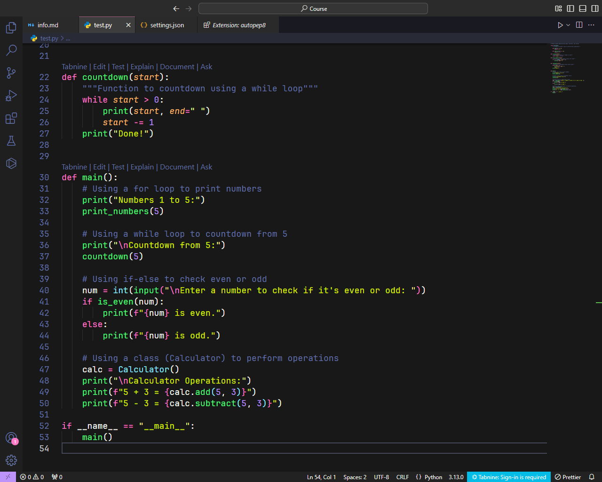
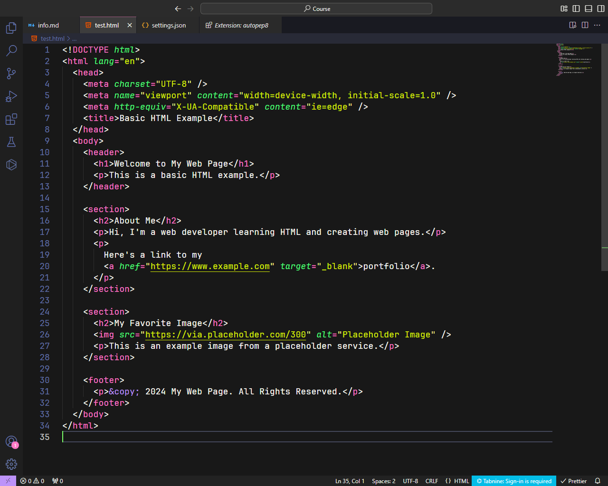
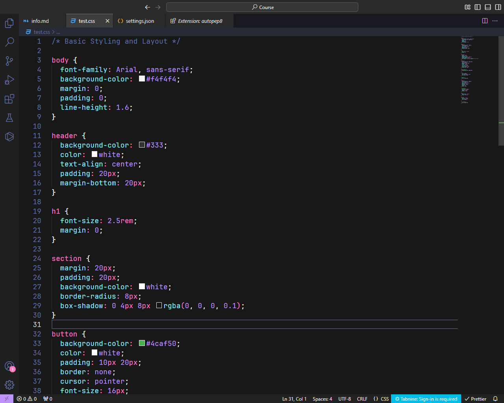
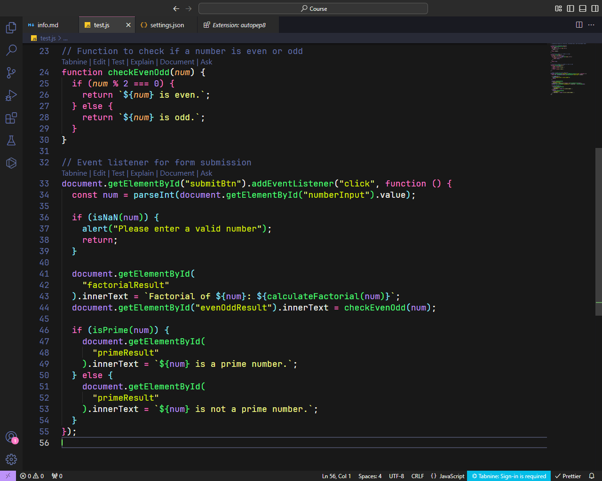
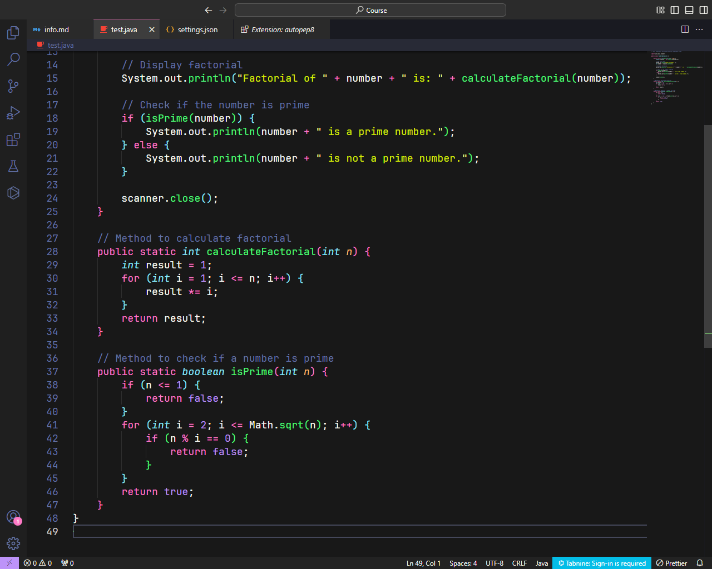

# Best VSCode Extensions and Settings

## [Black Formatter Extension](https://marketplace.visualstudio.com/items?itemName=ms-python.black-formatter)

> Automatically formats your Python code according to **PEP 8 standards**, ensuring clean and consistent code.

## [Tailwind Docs Extension](https://marketplace.visualstudio.com/items?itemName=austenc.tailwind-docs)

> Provides quick access to **Tailwind CSS documentation** directly from your editor, making development faster and easier.

## [Tailwind CSS IntelliSense](https://marketplace.visualstudio.com/items?itemName=bradlc.vscode-tailwindcss)

> Enhances Tailwind CSS development with intelligent autocomplete, linting, and hover previews for classes.

## [Tabnine: AI Chat & Autocomplete](https://marketplace.visualstudio.com/items?itemName=TabNine.tabnine-vscode)

> Boosts productivity with AI-powered code autocomplete and chat support for languages like JavaScript, Python, TypeScript, Java, PHP, Go, and more.

## [SQLite Viewer](https://marketplace.visualstudio.com/items?itemName=qwtel.sqlite-viewer)

> Easily view and explore SQLite database files directly within VS Code, with a user-friendly interface and query support.

## [Python Type Hint](https://marketplace.visualstudio.com/items?itemName=njqdev.vscode-python-typehint)

> Provides intelligent type hint suggestions and autocompletion for Python, improving code clarity and maintainability.

## [Python Indent](https://marketplace.visualstudio.com/items?itemName=KevinRose.vsc-python-indent)

> Automatically adjusts Python indentation to match PEP 8 standards, ensuring consistent and clean code formatting.

## [Prettier - Code formatter](https://marketplace.visualstudio.com/items?itemName=esbenp.prettier-vscode)

> An opinionated code formatter that supports many languages, ensuring consistent style and formatting across your codebase.

## [Material Icon Theme](https://marketplace.visualstudio.com/items?itemName=PKief.material-icon-theme)

> Enhances your VS Code experience with beautiful, easy-to-recognize file and folder icons based on Material Design.

## [Live Preview](https://marketplace.visualstudio.com/items?itemName=ms-vscode.live-server)

> Launch a local development server with live reload capability for static and dynamic pages, enhancing your web development workflow.

## [JetBrains IDE Keymap](https://marketplace.visualstudio.com/items?itemName=isudox.vscode-jetbrains-keybindings)

> Brings JetBrains IDE keybindings to VS Code, allowing you to use familiar shortcuts and navigation if you're transitioning from JetBrains products.

## [Dracula Theme Official](https://marketplace.visualstudio.com/items?itemName=dracula-theme.theme-dracula)

> A dark and visually stunning theme with vibrant colors, perfect for reducing eye strain during long coding sessions.

## [Django](https://marketplace.visualstudio.com/items?itemName=batisteo.vscode-django)

> Provides support for Django development in VS Code with features like syntax highlighting, code snippets, and easy navigation for Django templates and views.

## [autopep8](https://marketplace.visualstudio.com/items?itemName=ms-python.autopep8)

> Automatically formats Python code to conform to the PEP 8 style guide, helping you maintain consistent and clean code.

## [VS Code Custom Settings](#)

> A highly customized VS Code Theme and settings.

```
{
  "workbench.colorTheme": "Dracula Theme",
  // "workbench.colorTheme": "GitHub Dark Default",
  "files.autoSave": "afterDelay",
  "editor.mouseWheelZoom": true,
  "explorer.confirmDelete": false,
  "editor.stickyScroll.enabled": false,
  "editor.wordWrap": "on",
  "html.format.templating": true,
  "emmet.includeLanguages": {
    "django-html": "html"
  },
  "tailwindCSS.includeLanguages": {
    "django-html": "html"
  },
  "workbench.iconTheme": "material-icon-theme",
  "livePreview.notifyOnOpenLooseFile": false,
  "livePreview.customExternalBrowser": "Chrome",
  "terminal.sourceControlRepositoriesKind": "external",
  "livePreview.openPreviewTarget": "External Browser",
  "[javascript]": {
    "editor.defaultFormatter": "esbenp.prettier-vscode"
  },
  "code-runner.clearPreviousOutput": true,
  "code-runner.runInTerminal": false,
  "code-runner.showExecutionMessage": false,
  "[css]": {
    "editor.defaultFormatter": "esbenp.prettier-vscode"
  },
  "[javascriptreact]": {
    "editor.defaultFormatter": "esbenp.prettier-vscode"
  },
  "[html]": {
    "editor.defaultFormatter": "esbenp.prettier-vscode"
  },
  "editor.fontFamily": "JetBrains Mono, Consolas, 'Courier New', monospace",
  "[jsonc]": {
    "editor.defaultFormatter": "esbenp.prettier-vscode"
  },
  "workbench.colorCustomizations": {
    "editor.background": "#181818", // Editor background
    "sideBar.background": "#141414", // Sidebar background
    "activityBar.background": "#1f1f1f", // Activity bar background
    "titleBar.activeBackground": "#2b2b2b", // Title bar background (active window)
    "titleBar.inactiveBackground": "#2f2f2f", // Title bar background (inactive window)
    "statusBar.background": "#222222", // Status bar background
    "panel.background": "#0f0f0f", // Panel background (terminal, output, etc.)
    "tab.activeBackground": "#3d3d3d", // Active tab background
    "tab.inactiveBackground": "#2a2a2a", // Inactive tab background
    "editorCursor.foreground": "#79ff67", // Cursor color
    "tab.inactiveForeground": "#e2e2e2", // Inactive tab text color

    // Terminal specific colors
    "terminal.background": "#181818", // Terminal background color
    "terminal.foreground": "#d5d5d5", // Terminal foreground (text) color
    "terminalCursor.background": "#d5d5d5", // Cursor background color in terminal
    "terminalCursor.foreground": "#ffffff" // Cursor foreground (text) color in terminal
  },
  "editor.tokenColorCustomizations": {
    "textMateRules": [
      {
        "scope": "string.quoted",
        "settings": {
          // "foreground": "#09d62b" // Orange color for string literals
          "foreground": "#d5ec03" // Orange color for string literals
          // "foreground": "#21c8ce" // Orange color for string literals
        }
      },
      {
        "scope": "string, punctuation.definition.string.begin, punctuation.definition.string.end",
        "settings": {
          // "foreground": "#21c8ce"
        }
      }
    ]
  },
  "editor.cursorBlinking": "expand",
  "tabnine.experimentalAutoImports": true,
  "[python]": {
    "editor.defaultFormatter": "ms-python.autopep8"
  },
  "autopep8.args": ["--indent-size=2"],
  "editor.insertSpaces": true,
  "editor.tabSize": 2,
  "editor.indentSize": 2,
  "explorer.fileNesting.patterns": {
    "*.ts": "${capture}.js",
    "*.js": "${capture}.js.map, ${capture}.min.js, ${capture}.d.ts",
    "*.jsx": "${capture}.js",
    "*.tsx": "${capture}.ts",
    "tsconfig.json": "tsconfig.*.json",
    "package.json": "package-lock.json, yarn.lock, pnpm-lock.yaml, bun.lockb",
    "*.sqlite": "${capture}.${extname}-*",
    "*.db": "${capture}.${extname}-*",
    "*.sqlite3": "${capture}.${extname}-*",
    "*.db3": "${capture}.${extname}-*",
    "*.sdb": "${capture}.${extname}-*",
    "*.s3db": "${capture}.${extname}-*"
  },
  "[json]": {
    "editor.defaultFormatter": "vscode.json-language-features"
  }
  // "editor.detectIndentation": false
}
```

<br>

### Python



### HTML



### CSS



### JavaScript



### Java

